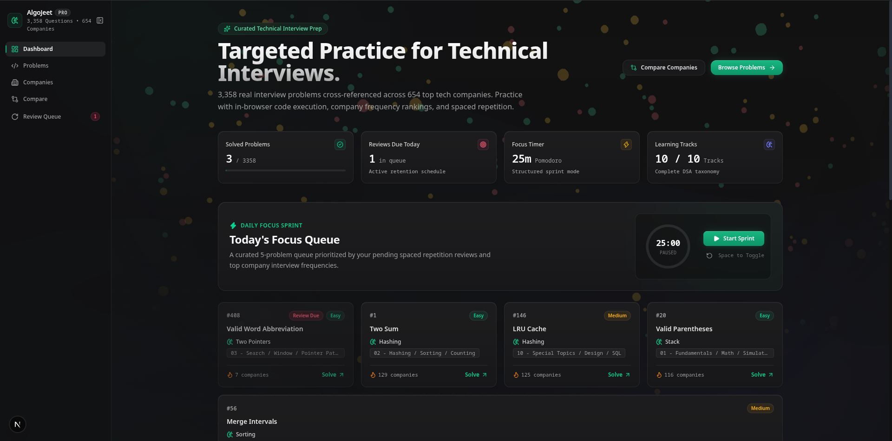
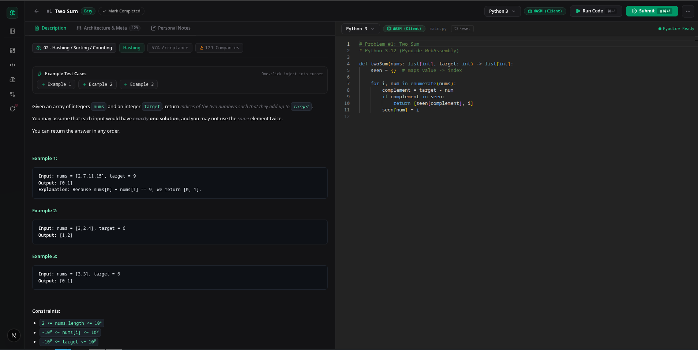
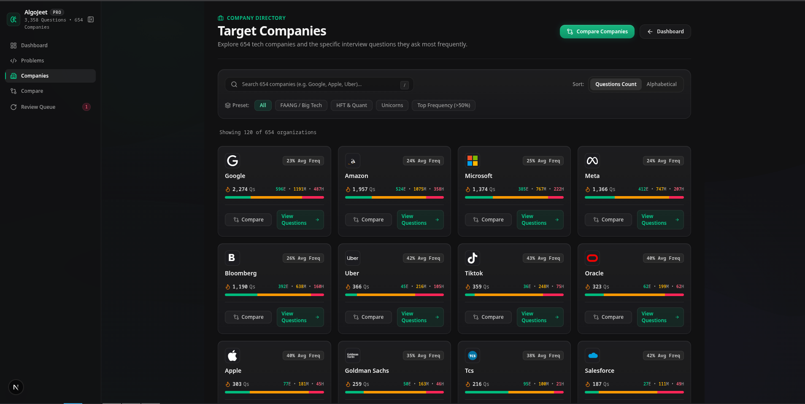
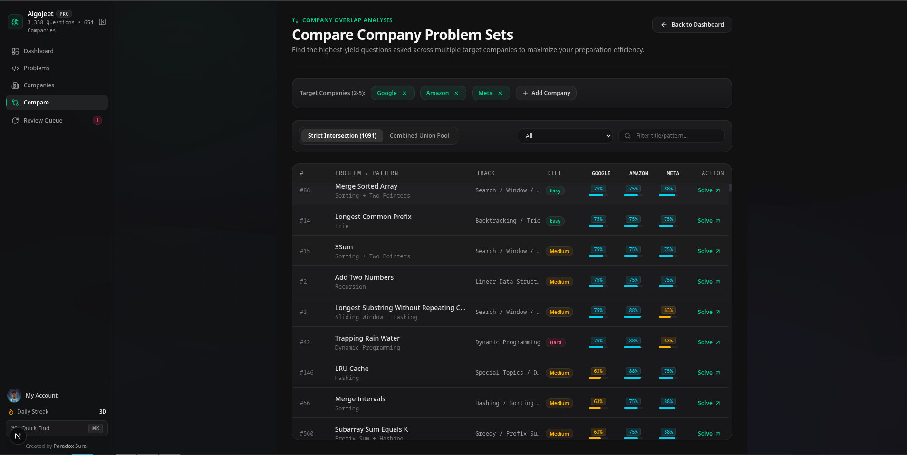
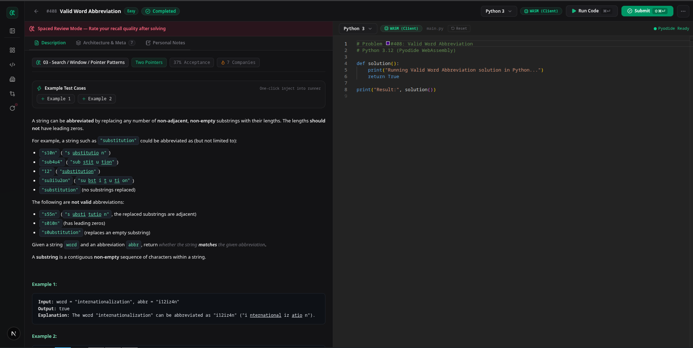
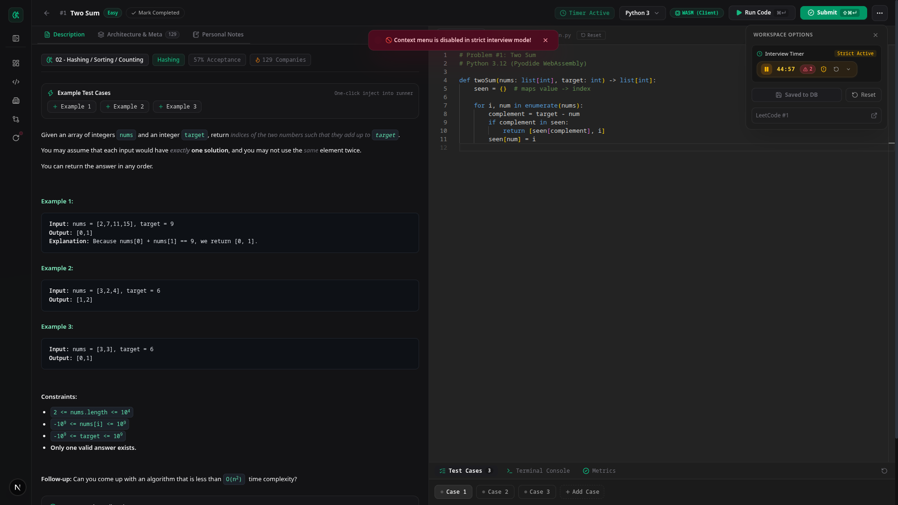

# AlgoJeet Pro

[](https://algojeet-pro.vercel.app)
[](https://github.com/paradox-suraj/coderrr/actions)

> **Local-First Technical Interview Preparation Platform**  
> Practice 3,350+ real LeetCode problems cross-referenced across 650+ tech companies with in-browser execution, company frequency analytics, and spaced repetition.

🔗 **Live Link**: [https://algojeet-pro.vercel.app](https://algojeet-pro.vercel.app)

---

## Overview

**AlgoJeet Pro** is a modern, high-performance coding interview workbench engineered for developers preparing for technical rounds at top technology companies. 

Unlike traditional platforms that rely heavily on server roundtrips, AlgoJeet Pro is built **local-first**: all problems, solutions, notes, and Python/JavaScript code execution run directly inside your browser via WebAssembly (Pyodide) and IndexedDB (Dexie).

---

## Screenshots

### 1. Daily Focus Dashboard & Retention Queue
Targeted practice dashboard featuring Pomodoro focus timer, active retention queue, and curated algorithmic tracks.



### 2. In-Browser Code Workspace & Execution Harness
Split-pane Monaco editor with client-side WebAssembly execution (Pyodide Python 3 / Web Worker JavaScript), instant test case runner, and spaced repetition rating.



### 3. Company Problem Directory & Frequency Analytics
Filter and explore interview question frequencies across 654 top technology companies with frequency distributions and overlap comparator.



### 4. Company Overlap Comparator & High-Yield Intersections
Compare multiple target companies (e.g. Google, Amazon, Meta) simultaneously to identify the highest-frequency shared interview questions and maximize prep ROI.



### 5. Spaced Repetition Review Queue (SM-2)
Structured retention mode scheduling automated review sessions with recall difficulty rating (Again, Hard, Good, Easy) for long-term algorithmic mastery.



### 6. Strict Interview Simulation Mode & Anti-Cheat Controls
Simulate realistic technical interview conditions with countdown presets, disabled clipboard shortcuts (copy/cut/paste), blocked context menus, and active tab-switch violation tracking.



---

## Core Features

- **3,358 Curated Problems**: Comprehensive problem descriptions, constraints, examples, and edge cases across 10 structured learning tracks (Two Pointers, Sliding Window, Trees & Graphs, Dynamic Programming, Greedy, Design, etc.).
- **654 Company Archives**: Real frequency ratings for questions asked by Google, Meta, Amazon, Microsoft, Apple, Netflix, Citadel, Stripe, Uber, and hundreds more.
- **Company Overlap Comparator**: Compare 2–5 target companies to find the highest-yield intersection problems, maximizing interview prep ROI.
- **In-Browser & Cloud Code Execution**:
  - **Python 3**: Runs 100% client-side via Pyodide (WebAssembly) with custom assertion normalization. Zero network required.
  - **JavaScript**: Executes 100% client-side in isolated Web Workers. Zero network required.
  - **C++ & Java**: Supported via a server-side execution pipeline with circuit breakers, rate limiting, and Piston sandboxing (requires configured `PISTON_URL` or self-hosted Docker runner; workspace displays setup badge when runner configuration is required).
- **Spaced Repetition (SM-2)**: Automatically schedules reviews based on your recall quality ratings (Again, Hard, Good, Easy) to lock patterns into long-term memory.
- **Daily Focus Sprint**: 25-minute Pomodoro focus timer with a curated 5-problem queue prioritized by due reviews and company frequencies.
- **Local-First & Private**: Problem datasets, code buffers, spaced repetition reviews, Monaco editor distribution, and in-browser Python (Pyodide WASM) execute offline via service worker caching and IndexedDB. Sign in with Clerk to optionally sync across devices via Supabase.

---

## Tech Stack

| Layer | Technology |
|---|---|
| **Framework** | [Next.js 15 (App Router)](https://nextjs.org/) + [React 19](https://react.dev/) |
| **Language** | [TypeScript 5](https://www.typescriptlang.org/) |
| **Styling** | [Tailwind CSS 4](https://tailwindcss.com/) + Lucide Icons |
| **Editor** | [Monaco Editor (@monaco-editor/react)](https://microsoft.github.io/monaco-editor/) |
| **In-Browser Python** | [Pyodide (WebAssembly)](https://pyodide.org/) |
| **Local Database** | [Dexie.js (IndexedDB)](https://dexie.org/) |
| **Search Engine** | [Orama](https://oramasearch.com/) client-side search worker |
| **Visualization** | [Three.js](https://threejs.org/) & [React Three Fiber](https://r3f.docs.pmnd.rs/) |
| **Authentication** | [Clerk](https://clerk.com/) |
| **Cloud Sync** | [Supabase Postgres](https://supabase.com/) |
| **Testing** | [Playwright](https://playwright.dev/) + Node Test Runner |

---

## Getting Started

### Prerequisites

- **Node.js**: `v20.9.0` or higher
- **Package Manager**: `pnpm` (`v9+` recommended)

### Installation

1. **Clone the repository**:
   ```bash
   git clone https://github.com/paradox-suraj/coderrr.git algojeet-pro
   cd algojeet-pro
   ```

2. **Install dependencies**:
   ```bash
   pnpm install
   ```

3. **Configure environment variables** (optional for local usage):
   ```bash
   cp .env.local.example .env.local
   ```
   *Note: AlgoJeet Pro is architected local-first. Core problem solving, Monaco editor, in-browser Python execution, and Dexie IndexedDB storage work without internet connectivity once cached. Remote code execution (C++/Java via Piston) and cross-device sync (Clerk/Supabase) require active internet connectivity.*

4. **Start the development server**:
   ```bash
   pnpm dev
   ```
   Open [http://localhost:3000](http://localhost:3000) to view the application or access the live deployment at [https://algojeet-pro.vercel.app](https://algojeet-pro.vercel.app).

---

## Available Scripts

| Command | Description |
|---|---|
| `pnpm dev` | Starts Next.js development server with Turbopack |
| `pnpm build` | Ingests data files and creates optimized production build |
| `pnpm start` | Runs the production build |
| `pnpm lint` | Runs ESLint analysis across TypeScript and React code |
| `pnpm test` | Runs the full unit and integration test suite |
| `pnpm e2e` | Runs Playwright end-to-end and accessibility test suites |
| `pnpm ingest` | Re-indexes problems and company mappings from dataset |

---

## Keyboard Shortcuts

| Shortcut | Action |
|---|---|
| `⌘K` or `Ctrl+K` | Open global Quick Find / Command Palette |
| `[` or `⌘B` / `Ctrl+B` | Toggle left navigation sidebar |
| `Space` | Toggle Pomodoro focus timer (when not typing in editor) |
| `⌘Enter` or `Ctrl+Enter` | Run current code against test cases in workspace |
| `Esc` | Close modal or Command Palette |

---

## Project Structure

```
algojeet-pro/
├── public/
│   ├── data/             # Static datasets: problems, companies, mappings, descriptions
│   └── logos/            # Company logos (SVG & PNG)
├── src/
│   ├── app/              # Next.js App Router (pages, API routes, layout)
│   ├── components/       # UI components: workspace, companies, navigation, canvas
│   ├── lib/
│   │   ├── auth/         # Clerk authentication helpers
│   │   ├── db/           # Dexie IndexedDB schema & SM-2 algorithm
│   │   ├── execution/    # Piston C++/Java runner, queue & circuit breaker
│   │   ├── hooks/        # Custom React hooks (timer, strict mode, due count)
│   │   ├── runners/      # Client-side Python & JavaScript code execution
│   │   └── workers/      # Pyodide and Orama search Web Workers
├── scripts/              # Dataset ingestion and utility scripts
├── supabase/             # Postgres migrations for cloud sync
└── tests/                # Unit, integration, and test harness suites
```

---

## Author

Created by **[Paradox Suraj](https://www.instagram.com/paradox.suraj/)**

---

## License

This project is licensed under the MIT License.
